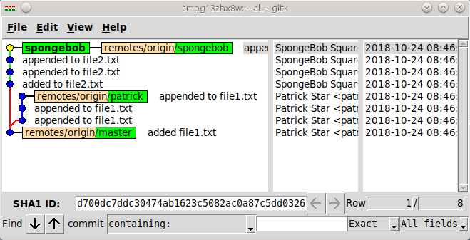

This page has some explanation of various git concepts and links to some asciinema asciicast demonstrations.

## Prerequisites: You should be familiar with the basics

The git documentation has a basic [tutorial](https://git-scm.com/docs/gittutorial).
It contains the same info as what you get from man gittutorial if you have
the git man pages installed.

The git documentation also has the complete [ProGit book](https://git-scm.com/book/en/v2).
It does a better job of explaining everything here, so why are you here anyway?.

Don't forget the manpages, either on your local machine or [online](https://git-scm.com/docs).

This [Visual GIT Guide](https://marklodato.github.io/visual-git-guide/index-en.html)
may be useful if you are a visual thinker.

This [git cheat sheet](http://ndpsoftware.com/git-cheatsheet.html) is a great guide
to how different commands affect your working directory, index, local repository,
remote repository and stash.

The above cheat sheet has a link to a
[flow chart](http://justinhileman.info/article/git-pretty/git-pretty.png)
that guides you out of any git mess you find yourself in.

## Practical Basics: Viewing history

### There is more to git log than you may think

Like nearly all git commands, git log has many options.
You probably already know about some of the standards,
with no option you get a basic log.
With `-p` your get diff output.
The `--stat` option gives you diffstat info.
An option that you may not have ever heard of is the `-g` for graphical
or at least as graphical as terminal output can be.

Adding lines like these to your .gitconfig will give you three flavours of
graphical git log.

```
[alias]
    lg = !"git lg1"
    lg1 = !"git lg1-specific --all"
    lg2 = !"git lg2-specific --all"
    lg3 = !"git lg3-specific --all"

    lg1-specific = log --graph --abbrev-commit --decorate --format=format:'%C(bold blue)%h%C(reset) - %C(bold green)(%ar)%C(reset) %C(white)%s%C(reset) %C(dim white)- %an%C(reset)%C(bold yellow)%d%C(reset)'
    lg2-specific = log --graph --abbrev-commit --decorate --format=format:'%C(bold blue)%h%C(reset) - %C(bold cyan)%aD%C(reset) %C(bold green)(%ar)%C(reset)%C(bold yellow)%d%C(reset)%n''          %C(white)%s%C(reset) %C(dim white)- %an%C(reset)'
    lg3-specific = log --graph --abbrev-commit --decorate --format=format:'%C(bold blue)%h%C(reset) - %C(bold cyan)%aD%C(reset) %C(bold green)(%ar)%C(reset) %C(bold cyan)(committed: %cD)%C(reset) %C(bold yellow)%d%C(reset)%n''          %C(white)%s%C(reset)%n''          %C(dim white)- %an <%ae> %C(reset) %C(dim white)(committer: %cn <%ce>)%C(reset)'
```

The `git lg3` version is demonstrated here:

<script src="https://asciinema.org/a/208167.js" id="asciicast-208167" async></script>

### Gitk is the one gui tool even command line folks should be using

As useful as graphical git log can be, you will probably still prefer gitk.
It is written in ancient tcl/tk but is a pretty good tool for seeing git logs
and branching.



It takes a branch name as an argument, if you are lazy try `--a -a`, one of these means all branches
and I have no idea what the other means.
If you are inspecting a repo that has been around for a long time and you don't want `gitk` to spend
forever sucking in old history then use the `--since` option, it takes lots of sorta english
descriptions of dates.

```
gitk -a --all --since='1 month'
gitk -a --all --since='1 jan'
```

The quotes can be omitted if periods are used instead of spaces in the date string. 

```
gitk -a --all --since=1.month
gitk -a --all --since=1.jan
```

There is an appendix to the online git doc that says a bit about
[gitk](https://git-scm.com/book/en/v2/Appendix-A:-Git-in-Other-Environments-Graphical-Interfaces).
Another command git-gui is mentioned, I have accidently stumbled into git-gui a few times
and was as confused as non-vi user is when they accidently type `vi`.

If you are an old school X11 user and use "select to copy, middle mouse to paste" then
you need to know that when you click on a commit in gitk the value in the box
labeled __SHA1 ID__ gets updated to that commit's sha1 and it gets
copied to the middle mouse paste buffer, so you can left click on a commit in gitk
then middle mouse to paste elsewhere.

### Bitbucket sucks

Our bitbucket instance teases at having branch visualization but then does a
bait and switch and tells you that you need to pay for the supposedly Awesome
Graphs plugin.

## Things asked at least once

### Copying a local repo

Let's say you have a repo checked out for use with a distro builder like
yocto and you want to checkout the same repo for doing local kernel
builds. You will be making changes but none that you want to push upstream
so you really want everything local.

#### Clone an existing repo into an empty directory

```
mkdir -p /tmp/path/to/new/repo
cd /tmp/path/to/new/repo
git clone ~/work/disasters/git-class/git-examples
cd git-examples
git remote -v
origin  /home/jcrigby/work/disasters/git-class/git-examples/ (fetch)
origin  /home/jcrigby/work/disasters/git-class/git-examples/ (push)
git branch -a
* master
  remotes/origin/HEAD -> origin/master
  remotes/origin/master
  remotes/origin/noaltscreeen
  remotes/origin/noaltscreen
```

#### Add a existing repo to a different existing repo

```
cd /tmp/path/existing/
git init
Initialized empty Git repository in /tmp/path/existing/.git/
git remote add my-other-repo /home/jcrigby/work/disasters/git-class/
ng$ (master) git remote add my-other-repo /home/jcrigby/work/disasters/git-class/git-examples/.git
git remote update
Fetching my-other-repo
remote: Counting objects: 167, done.
remote: Compressing objects: 100% (115/115), done.
remote: Total 167 (delta 65), reused 79 (delta 27)
Receiving objects: 100% (167/167), 88.00 KiB | 7.33 MiB/s, done.
Resolving deltas: 100% (65/65), done.
From /home/jcrigby/work/disasters/git-class/git-examples/
 * [new branch]      master       -> my-other-repo/master
 * [new branch]      noaltscreeen -> my-other-repo/noaltscreeen
 * [new branch]      noaltscreen  -> my-other-repo/noaltscreen
git branch -a
  remotes/my-other-repo/master
  remotes/my-other-repo/noaltscreeen
  remotes/my-other-repo/noaltscreen
git reset --hard my-other-repo/master
```

#### Pushing back to a local remote

If you want to push back to the original local repo you will get an error if
pushing to the current checked out branch:
```
echo foo > foofile
git add foofile
git commit -m 'added foofile'
[master ac043ce] added foofile
 1 file changed, 1 insertion(+)
 create mode 100644 foofile
jcrigby@Hoid:/tmp/path/existing$ (master) git push my-other-repo HEAD:master
Counting objects: 3, done.
Delta compression using up to 8 threads.
Compressing objects: 100% (2/2), done.
Writing objects: 100% (3/3), 280 bytes | 280.00 KiB/s, done.
Total 3 (delta 1), reused 0 (delta 0)
remote: error: refusing to update checked out branch: refs/heads/master
remote: error: By default, updating the current branch in a non-bare repository
remote: is denied, because it will make the index and work tree inconsistent
remote: with what you pushed, and will require 'git reset --hard' to match
remote: the work tree to HEAD.
remote:
remote: You can set the 'receive.denyCurrentBranch' configuration variable
remote: to 'ignore' or 'warn' in the remote repository to allow pushing into
remote: its current branch; however, this is not recommended unless you
remote: arranged to update its work tree to match what you pushed in some
remote: other way.
remote:
remote: To squelch this message and still keep the default behaviour, set
remote: 'receive.denyCurrentBranch' configuration variable to 'refuse'.
To /home/jcrigby/work/disasters/git-class/git-examples/.git
 ! [remote rejected] HEAD -> master (branch is currently checked out)
error: failed to push some refs to '/home/jcrigby/work/disasters/git-class/git-examples/.git'
```

Create a different branch so we are not trying to push to master which is
the current checked out branch on the other end.

```
git checkout -b mypushablebranch
Switched to a new branch 'mypushablebranch'
git push my-other-repo HEAD:mypushablebranch
Counting objects: 3, done.
Delta compression using up to 8 threads.
Compressing objects: 100% (2/2), done.
Writing objects: 100% (3/3), 280 bytes | 280.00 KiB/s, done.
Total 3 (delta 1), reused 0 (delta 0)
To /home/jcrigby/work/disasters/git-class/git-examples/.git
 * [new branch]      HEAD -> mypushablebranch
```

Now back at the original we can see the branch we just pushed.

```
git branch -v
* master           4d864bd update about gitk sha1 magic copy paste
  mypushablebranch ac043ce added foofile
  noaltscreeen     d8801ae fix speechbubble to not use alt screen
  noaltscreen      d8801ae fix speechbubble to not use alt screen
```

### Dealing with conflicts

Epic fail, nothing here yet.

### Trivial local only cleaning up with git rebase -i

You have local edits that were done in a haphazard way and you want to 
consolidate them before pulling in the latest upstream or pushing to a
repo to do a pull request.
All the changes are local and nothing has been pushed anywhere so you
are safe rebasing. Time to learn `git rebase -i`.

This is a simple example of adding and modifying two files over several
commits.
We would like to consolidate some of those commits, and reword one.

<script src="https://asciinema.org/a/208270.js" id="asciicast-208270" async></script>

## Advanced Philosophy: Merge vs Rebase

### tl;dr
Our history is such a mess and our product is not a commit history so don't
bother with non trivial rebasing

### Only for the curious

Let's go back to ancient history (2009) and checkout some advice from Linus
Torvalds that is still relevant today.
This was deemed important enough that LWN did a write up on it
[here](https://lwn.net/Articles/328436/) and the original email from Linus
is also on LWN [here](https://lwn.net/Articles/328438/).

The context is the Linux kernel mailing list and he is specifically addressing
what he expects from subsystem maintainers, however, the spirit of the message
is true more widely:

* Never rewrite aka rebase published history.
* Don't publish work-in-progress crap.

Pushing to a private remote repo does not constitute publishing.
Publishing is pushing to a repo that others will be consuming.

One excerpt from Linus explains why I always rebase locally:

> Keep your own history readable,
>
> Some people do this by just working things out in their head first, and 
> not making mistakes. But, that's very rare, and for the rest of us, we 
> use "git rebase" etc while we work on our problems. 

> So "git rebase" is not wrong. But it's right only if it's YOUR VERY OWN 
> PRIVATE git tree.

## Examples: How rebase can help you clean up your history

### Pathological Merge

In this contrived example a developer tries to push a trivial change but the
upstream keeps changing out from under him.
On each failure he pulls again with `git pull` which results in a merge commit.
Eventually he succeeds; however, the log is a mess.

<script src="https://asciinema.org/a/208164.js" id="asciicast-208164" async></script>

### Avoiding the messiness

In this example everything is the same as above except we add the `--rebase`
option to the `git pull` command.
The same number of attempts at pushing are required; however, the resulting
history is much cleaner.

<script src="https://asciinema.org/a/208158.js" id="asciicast-208158" async></script>

#### tl;dr 

Wait wasn't there a tl;dr above?

Adding `--rebase` to your `git pull` can make your resulting history less ugly.
However, all the problems of rebase apply so only do this if you know what you are doing.
If you only have your own changes locally and you are simply syncing with upstream
then you are probably ok.
If you have pulled other changes into your repo then you definitely do not want
to rebase because in the process you could easily rewrite someone else's history.

## Hard Questions: So is there a problem with combining merging and rebasing?

Merging is just creating a new commit with two parents instead of one and then
checking for conflicts.
The search for conflicts is done be doing a diff to a common ancestor and making
sure the two commits being merged don't both change a file with respect
to the ancestor in a conflicting way.

Rebasing is just automated cherry picking of a series of commits.

There is nothing inherently dangerous about mixing these two other than
the rebase issues already mentioned.

### But what about the thing that happend?

Let's recreate a similar scenario to answer this one.
